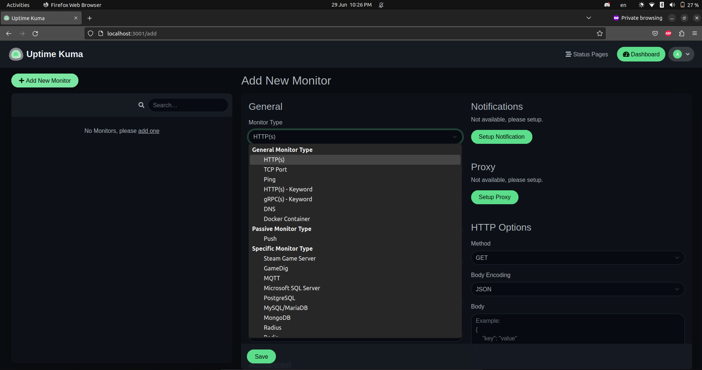

## Introduction
Monitoring your IT infrastructure plays a critical role in today's IT operations. IT teams depend on the Network Operations Center (NOC) team so that they get informed when there is a problem with any of their IT infrastructure, especially if the teams are working remotely. 

Today, I'll be introducing Uptime Kuma, a simple yet powerful open-source uptime monitoring tool. 


## Uptime Kuma
Before we dive into its features and how it works, let us first define what it is and what it isn't.

### What It Is
At its core, Uptime Kuma monitors the uptime of a specific service or machine. It uses HTTP(S), TCP, ICMP, and other monitor types to connect to the remote resource you want to monitor. 
It can also monitor the uptime of docker containers. 

### What It Isn't
Uptime Kuma doesn't monitor host or network metrics such as memory, CPU, and network utilization. 

## Installation
You can install it as a standalone application or install it as a Docker container. I'll be installing it on a docker container, so you'll need to install docker if you want to follow along. 
You can find the installation guide for docker for Ubuntu [here](https://docs.docker.com/engine/install/ubuntu/). I'm using Ubuntu in this tutorial, but you can install docker on any OS of your choice.

If you want to install it as a standalone application, follow their [official guide](https://github.com/louislam/uptime-kuma).

Use the command below to run the Uptime Kuma container. 

```zsh
docker run -d --restart=always -p 3001:3001 -v uptime-kuma:/app/data --name uptime-kuma louislam/uptime-kuma:1
```

To check whether the container is up and running, issue the `docker ps` command and you should see the status stating healthy as shown below. 
```bash
yoel@ubuntu:~$ docker ps

CONTAINER ID   IMAGE                           COMMAND                  CREATED         STATUS                   PORTS                                            NAMES
fef1d9179458   louislam/uptime-kuma:1          "/usr/bin/dumb-init …"   5 minutes ago   Up 5 minutes (healthy)   0.0.0.0:3001->3001/tcp, :::3001->3001/tcp        uptime-kuma
```
The application is being served on port 3001. To access it, open your browser and type http://localhost:3001. Set up a username and password and you're ready to go. 
## Adding Monitors

Alright. Let's add our first monitor. As shown below, there are several types of monitors we can monitor. Click on **Add New Monitor**.



### HTTP(S)

We can use the *HTTP(S) monitor* to check the uptime of web applications using HTTP and HTTPS on port 80 and 443 respectively. 

**Friendly Name**: this field will be the display name shown on the dashboard. I'll be monitoring my website for this tutorial so I'll write 'My Website' here.  

**URL**: Enter the URL or IP address of the HTTP(S) server you want to monitor. I'll set it to 'https://yoellorenso.com'. 

**Heartbeat Interval**: the value (in seconds) of how often you want to monitor the service. The minimum value you can set for the interval is 20. I'll be setting it to 30 for this example. 

Take note that the lower you set this value, the more frequently Uptime Kuma will send the requests. Although we're only monitoring one device, it could increase your system's resource utilization if there were multiple monitors configured with low intervals. 

**Retries**: the number of maximum retries before the service is considered down. So if the service is unreachable, it'll try to reach it one more time before considering it down. 

**Accepted Status Code**: This is what HTTP status code is acceptable as a successful response. The default range is between 200-299 (successful responses), but you can change this or even add other status codes. I'll keep it as the default range.
To learn more about status codes, I'll leave a link [here](https://developer.mozilla.org/en-US/docs/Web/HTTP/Status).

For some advanced options, check the **Certificate Expiry Notification** option and Uptime Kuma will notify you ahead of time before the certificate expires. If you are not using any trusted certificate or you're using a self-signed certificate on the HTTPS app you want to monitor, check the Ignore TLS/SSL error for HTTPS websites. 

After you're done with your configuration, click on save and that's it. 
![[https-monitor.png]](./https-monitor.png)

That's it. Pretty straightforward. It does have a nice UI that's easy to use and simple to understand. 
![[yoellorenso-monitor.png]](./yoellorenso-monitor.png)

### TCP Port
This type of monitoring is useful if you want to monitor common services like SMTP (25, 465, or 587), MySQL (3306), or you could have an application running on a custom port. 

Monitoring TCP ports is almost the same as monitoring HTTP(S). Simply add the port number to the configuration. 

In this example, I'll be monitoring Google's SMTP server. The URL is **smtp.gmail.com** and the port I'm monitoring is 25. Let's configure it. 

![[smtp-config.png]](./smtp-monitor-config.png)

Hit save and that's it.

![[smtp-server.png]](./smtp-server.png)


## Conclusion

Uptime Kuma's strong suit is giving you a free and open-source option to monitor that you can self-host in your environment. There are alternatives but most of them are either paid products or hosted on public sites. 

There are some additional configurations you can continue with such as setting up notifications on Discord, Slack or even through email. You can also monitor docker containers if you choose to. 

I hope this was helpful. Thanks for reading. 
